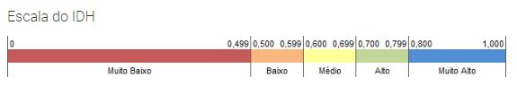

# Exercício de Casa 🏠 

## Qual o IDH?

<br>

**Crie um algoritmo utilizando Fluxograma e em seguida utilizando uma linguagem de programação ou pseudocódigo para a seguinte proposta:**

Precisamos de uma aplicação que verifique e retorne a classificação do IDH dos países listados abaixo de acordo com a Escala de IDH do Programa das Nações Unidas para o Desenvolvimento – PNUD da ONU;

> Neste exercício você vai utilizar: 

```js
let noruega = 0.944
let qatar = 0.850
let canada = 0.913
let brasil = 0.755
let japao = 0.891
let vietna = 0.666
let afeganistao = 0.465
let camaroes = 0.512
```


---

Terminou o exercício? Dá uma olhada nessa checklist e confere se tá tudo certinho, combinado?!

- [ ] Fiz o fork do repositório.
- [ ] Clonei o fork na minha máquina (`git clone url-do-meu-fork`).
- [ ] Resolvi o exercício.
- [ ] Adicionei as mudanças. (`git add .` para adicionar todos os arquivos, ou `git add nome_do_arquivo` para adicionar um arquivo específico)
- [ ] Commitei a cada mudança significativa ou na finalização do exercício (`git commit -m "Mensagem do commit"`)
- [ ] Pushei os commits na minha branch (`git push origin nome-da-branch`)
- [ ] Criei um Pull Request seguindo as orientaçoes que estao nesse [documento](https://github.com/mflilian/repo-example/blob/main/exercicios/para-casa/instrucoes-pull-request.md).
